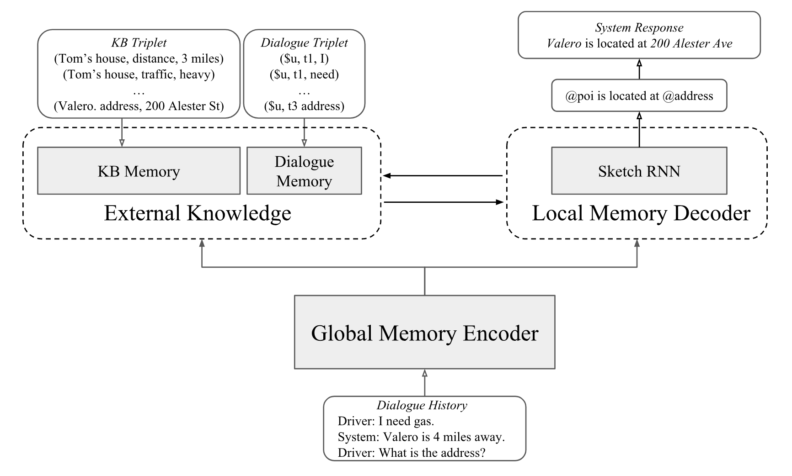

# GLMP
**Global-to-local Memory Pointer Networks for Task-Oriented Dialogue**. Chien-Sheng Wu, Richard Socher, Caiming Xiong. ***ICLR 2019***. [[PDF]](https://arxiv.org/abs/1901.04713). 

This code has been written using PyTorch >= 0.4. If you use any source codes or datasets included in this toolkit in your work, please cite the following paper. The bibtex are listed below:
<pre>
@article{wu2019global,
  title={Global-to-local Memory Pointer Networks for Task-Oriented Dialogue},
  author={Wu, Chien-Sheng and Socher, Richard and Xiong, Caiming},
  journal={Proceedings of the 7th International Conference on Learning Representations},
  year={2019}
}
</pre>

## Block Diagram
<p align="center">

</p>


## Import data
Under the utils folder, we have the script to import and batch the data for each dataset. 

## Train a model for task-oriented dialog datasets
We created `myTrain.py` to train models. You can run:
GLMP bAbI dialogue t1-5:
```console
❱❱❱ python3 myTrain.py -lr=0.001 -l=3 -hdd=128 -dr=0.2 -dec=GLMP -bsz=8 -ds=babi -t=1 
```
or GLMP SMD
```console
❱❱❱ python3 myTrain.py -lr=0.001 -l=3 -hdd=128 -dr=0.2 -dec=GLMP -bsz=8 -ds=kvr -t=
```

While training, the model with the best validation is saved. If you want to reuse a model add `-path=path_name_model` to the function call. The model is evaluated by using per responce accuracy, WER, F1 and BLEU.

## Test a model for task-oriented dialog datasets
We created  `myTest.py` to train models. You can run:
GLMP bAbI t1-5:
```console
❱❱❱ python myTest.py -ds=babi -path=<path_to_saved_model> 
```
or GLMP SMD 
```console
❱❱❱ python myTest.py -ds=kvr -path=<path_to_saved_model> -rec=1
```

## Visualization Memory Access

<p align="center">

</p>

## Architecture
<p align="center">


</p>

## Enjoy! :)
