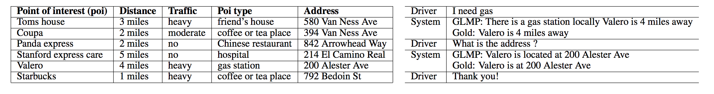
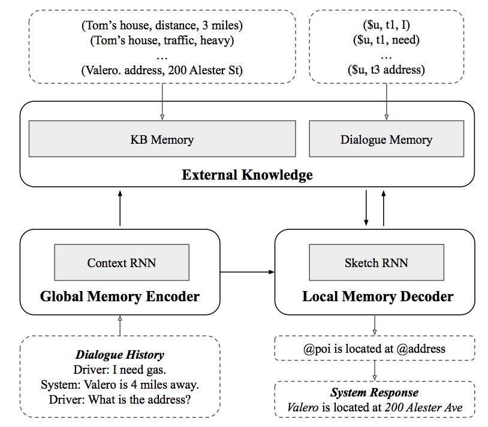
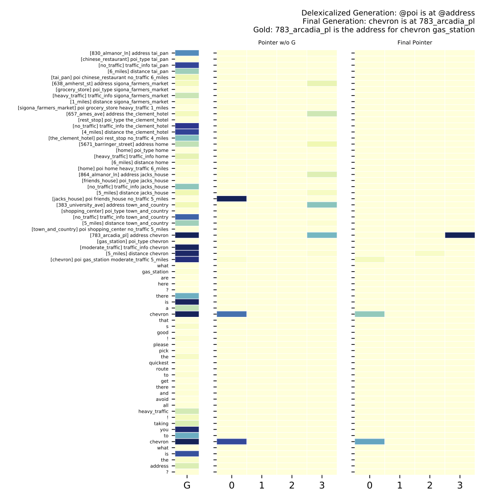
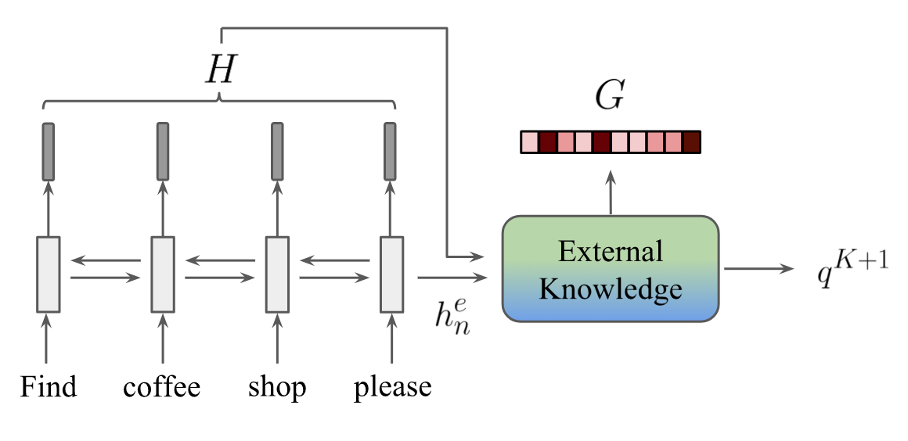
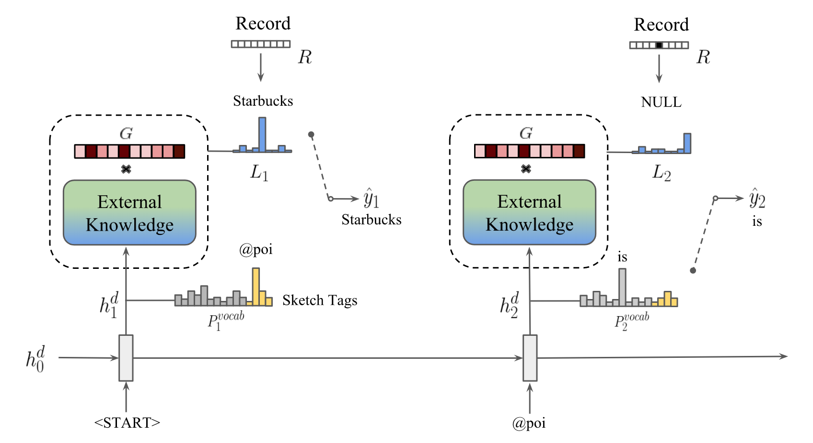

## Global-to-local Memory Pointer Networks for Task-Oriented Dialogue
 [](https://opensource.org/licenses/MIT) 

This is the PyTorch implementation of the paper:
**Global-to-local Memory Pointer Networks for Task-Oriented Dialogue**. [**Chien-Sheng Wu**](https://jasonwu0731.github.io/), [Richard Socher](https://www.socher.org/), [Caiming Xiong](http://www.stat.ucla.edu/~caiming/). ***ICLR 2019***. 
[[PDF]](https://arxiv.org/abs/1901.04713)[[Open Reivew]](https://openreview.net/forum?id=ryxnHhRqFm)


This code has been written using PyTorch >= 0.4. If you use any source codes or datasets included in this toolkit in your work, please cite the following paper. The bibtex are listed below:
<pre>
@inproceedings{wu2019global,
  title={Global-to-local Memory Pointer Networks for Task-Oriented Dialogue},
  author={Wu, Chien-Sheng and Socher, Richard and Xiong, Caiming},
  booktitle={Proceedings of the International Conference on Learning Representations (ICLR)},
  year={2019}
}
</pre>

<p align="center">

</p>

## Abstract
End-to-end task-oriented dialogue is challenging since knowledge bases are usually large, dynamic and hard to incorporate into a learning framework. We propose the global-to-local memory pointer (GLMP) networks to address this issue. In our model, a global memory encoder and a local memory decoder are proposed to share external knowledge. The encoder encodes dialogue history, modifies global contextual representation, and generates a global memory pointer. The decoder first generates a sketch response with unfilled slots. Next, it passes the global memory pointer to filter the external knowledge for relevant information, then instantiates the slots via the local memory pointers. We empirically show that our model can improve copy accuracy and mitigate the common out-of-vocabulary problem. As a result, GLMP is able to improve over the previous state-of-theart models in both simulated bAbI Dialogue dataset and human-human Stanford Multi-domain Dialogue dataset on automatic and human evaluation.

<p align="center">

</p>

## Train a model for task-oriented dialog datasets
We created `myTrain.py` to train models. You can run:
GLMP bAbI dialogue t1-5:
```console
❱❱❱ python3 myTrain.py -lr=0.001 -l=1 -hdd=128 -dr=0.2 -dec=GLMP -bsz=8 -ds=babi -t=1 
```
or GLMP SMD
```console
❱❱❱ python3 myTrain.py -lr=0.001 -l=1 -hdd=128 -dr=0.2 -dec=GLMP -bsz=8 -ds=kvr
```

While training, the model with the best validation is saved. If you want to reuse a model add `-path=path_name_model` to the function call. The model is evaluated by using per responce accuracy, WER, F1 and BLEU.

## Test a model for task-oriented dialog datasets
We created  `myTest.py` to train models. You can run:
GLMP bAbI t1-5:
```console
❱❱❱ python myTest.py -ds=babi -path=<path_to_saved_model> 
```
or GLMP SMD 
```console
❱❱❱ python myTest.py -ds=kvr -path=<path_to_saved_model> -rec=1
```

## Visualization Memory Access
Memory attention visualization in the SMD navigation domain. Left column is the global memory pointer G, middle column is the memory pointer without global weighting, and the right column is the final memory pointer.

<p align="center">

</p>

## Architecture
<p align="center">


</p>

## Enjoy! :)
